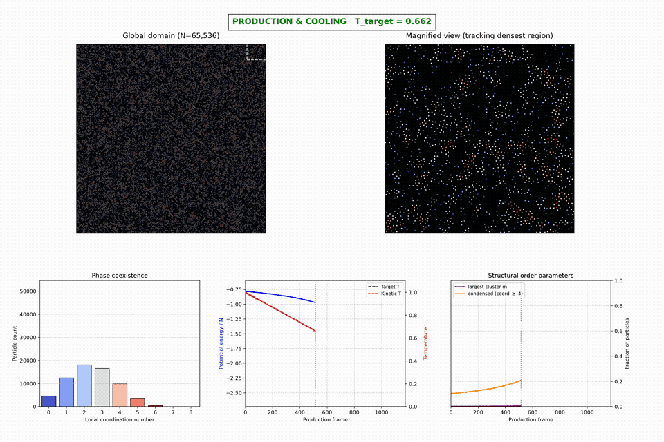
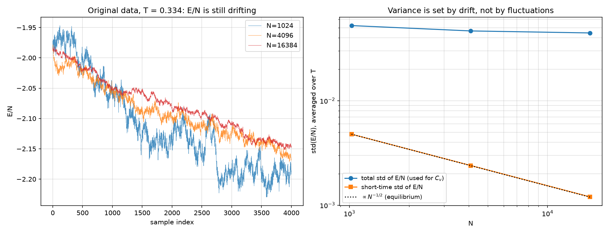
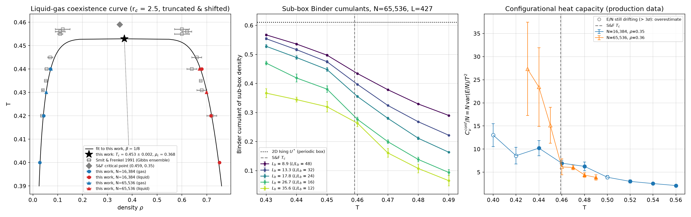

# Phase Transition & Nucleation Dynamics in a 2D Lennard-Jones Fluid

<div align="center">
  
  <p><i>N = 65,536 particles cooled from T = 1.0 to 0.30: homogeneous gas, liquid domains below T<sub>c</sub>, then freezing into hexagonal crystallites.
  Full video: <a href="outputs/quench_dashboard_1080p.mp4">outputs/quench_dashboard_1080p.mp4</a></i></p>
</div>

---

## Project overview

A from-scratch molecular dynamics study of the two-dimensional Lennard-Jones (LJ) fluid: how a homogeneous gas condenses and freezes under cooling, and where its liquid-gas critical point lies. All quantities are in reduced LJ units (σ = ε = m = k<sub>B</sub> = 1).

The project has three parts:

1. **Phase 1, local prototype:** a fully vectorized NumPy engine (all-pairs forces) and the diagnostic dashboard.
2. **Phase 2, large-N quench:** condensation and freezing of a 65,536-particle system on the GPU.
3. **Phase 3, critical point:** equilibrium simulations that locate the liquid-gas critical point and compare it with published results.

### What changed in v2

* **New O(N) GPU engine ([`lj2d/`](lj2d/)).** Cell-list Verlet neighbour lists replace the O(N²) all-pairs evaluation, and the force kernels are fused with `torch.compile`. One full time step at N = 32,768 now takes 0.86 ms on a Tesla T4, against 1.19 s for the force evaluation alone in the original Phase 2 engine, about 1,400× faster. A million particles take 9.5 ms per step. Several independent replicas, for example one per temperature, run together in one batch.
* **Tests ([`tests/`](tests/)).** Forces, energy and virial are checked against a brute-force float64 reference to 1e-9. The suite also checks Newton's third law, energy conservation without a thermostat, Andersen thermostat temperatures and cluster detection.
* **Phase 3 redone.** The original finite-size-scaling analysis measured a non-equilibrium drift instead of equilibrium fluctuations, and its temperature window lay below the critical point (details below). Longer, equilibrated simulations put the critical point at **T<sub>c</sub> = 0.453 ± 0.002**, 1.3% below the Gibbs-ensemble value 0.459 ± 0.001 of Smit & Frenkel (1991). It is far above the v1 estimate of 0.335.
* **Phase 2 re-run** with twice the particles and a slow cooling ramp through the critical and freezing regions.
* **Dashboard fixes.** Phase 1 and Phase 2 now share one dashboard, which works with current matplotlib (the removed `cm.get_cmap` call is gone). A condensed-fraction curve is added, and frames render in parallel.

---

## Quick start

```bash
uv venv .venv --python 3.14 && uv pip install -p .venv -r requirements.txt   # CUDA wheels: add the PyTorch index URL
.venv/bin/python -m pytest                                                     # 11 tests, CPU + GPU

# Phase 2: quench (~2 h on a T4 for N = 65,536), then render the dashboard
.venv/bin/python phase2_cloud/part2_generation_gpu.py --N 65536 --out /tmp/part2_quench.npz
.venv/bin/python phase2_cloud/part2_visualization.py --npz /tmp/part2_quench.npz --out quench.mp4

# Phase 3: temperature scan (resumable), per-scan analysis, combined phase diagram
.venv/bin/python phase3/run_critical_scan.py --N 16384 --rho 0.35 --temps 0.40:0.56:9 \
    --equil-steps 1000000 --prod-steps 3000000 --sample-every 1000 --out /tmp/lj_scan/N16384
.venv/bin/python phase3/analyze_critical.py /tmp/lj_scan/N16384 --out phase3/results/N16384
.venv/bin/python phase3/combine_scans.py phase3/results/N16384 phase3/results/N65536
```

---

## The engine

| | Original Phase 2 engine | `lj2d.LJSystem` |
| :--- | :--- | :--- |
| Pair search | all N² pairs, chunked | cell list → Verlet list (r<sub>c</sub> + 0.5 skin), rebuilt on displacement |
| Cost per step, N = 32,768 (T4) | 1.19 s (forces only) | 0.86 ms (full step) |
| Cost per step, N = 1,048,576 (T4) | not feasible (~20 min) | 9.5 ms |
| Potential | truncated at 2.5σ, not shifted | truncated and shifted at 2.5σ |
| Replicas | 1 | B in one batch (e.g. one per temperature) |
| Validation | none | 11 tests against brute force and conservation laws |

Integration uses velocity Verlet with an Andersen thermostat, so the runs sample the canonical (NVT) ensemble. Shifting the potential changes only the energy bookkeeping: forces, and therefore the dynamics and phase behaviour, are the same as for the truncated potential. With the shift, the total energy is continuous at the cutoff, which makes the energy-conservation test meaningful. This is the same model as the "truncated and shifted" potential in Smit & Frenkel (1991).

### Why it is fast

The speed-up comes mostly from doing far less work, and partly from doing that work more efficiently on the GPU. All timings below are on a Tesla T4 in float32.

**1. Only nearby pairs are evaluated (algorithmic, ~1,500× fewer pairs).**
The LJ force is cut off at r<sub>c</sub> = 2.5σ, so a particle interacts with only 15–22 neighbours at these densities, yet the original engine computed all N² separations. At N = 32,768 that is 1.07 × 10⁹ distances per step, against about N × 18 ≈ 6 × 10⁵ with a neighbour list. The list is built in two stages:
* **Cell list.** The box is cut into square cells at least r<sub>c</sub> + skin wide. Particles are sorted by cell into a padded table, so each particle's candidates are the occupants of its own cell and the 8 surrounding cells. This step costs O(N) and needs no loops in Python.
* **Verlet list.** From those candidates, every pair within r<sub>c</sub> + skin (skin = 0.5σ) is stored in a padded `[N, K]` index array. The list stays valid until some particle has moved more than skin/2, so it is rebuilt only about once every 10–11 steps (88 rebuilds per 1,000 steps in the Phase 3 runs). The other steps reuse it.

**2. The force calculation reads memory once (`torch.compile`, 7× on forces).**
Written in plain PyTorch, each line of the force calculation (separations, minimum image, r², masks, r⁻⁶, force, energy, virial) allocates a full `[N, K]` temporary and reads it back. That makes the calculation memory-bound. `torch.compile` fuses the whole kernel into a few Triton kernels that keep these values in registers. The same fusion is applied to the candidate filter in the list rebuild.

**3. The list rebuild avoids sorting.**
The first version packed each particle's neighbours into its row with an `argsort`, and a second attempt used a row-wise cumulative sum; both were slow on the GPU. The final version takes `nonzero()` of the hit mask, which is already in row order, and computes each hit's slot from a 1D cumulative sum of the per-row counts.

**4. Many independent systems run in one batch.**
Small systems are limited by the fixed cost of launching GPU kernels, not by arithmetic. `LJSystem` advances B replicas at once by giving every particle a global index b·N + i and giving every replica its own block of cells, so one set of kernels serves all replicas. Sixteen 1,024-particle systems take 1.06 ms per step together (about 15,000 replica-steps per second). This is how each Phase 3 scan runs all of its temperatures (7–9) in one process.

**5. Smaller choices**
* *Full neighbour list, gather only.* Each pair is stored from both sides, so every particle sums its own forces and no two GPU threads write to the same particle. That avoids atomic adds and makes results deterministic, at the cost of evaluating each pair twice.
* *float32.* The T4's float64 throughput is 1/32 of its float32 throughput. Positions in a box of side 470 keep about 3 × 10⁻⁵σ resolution, far below any physical length in the problem, and the brute-force tests confirm the forces.
* *Truncated potential with a cutoff.* This bounds K and is the potential the reference data uses.

**Measured effect of steps 2 and 3**, on the Phase 3 workload (9 replicas × 16,384 particles = 147,456 particles):

| | before | after | speed-up |
| :--- | ---: | ---: | ---: |
| force calculation | 4.37 ms | 0.60 ms | 7.3× |
| neighbour-list rebuild (every ~10 steps) | 16.4 ms | 5.0 ms | 3.3× |
| **full time step** (rebuild cost averaged in) | **6.47 ms** | **1.54 ms** | **4.2×** |

**Rendering** was made faster separately. The dashboard splits the frames across worker processes and joins the pieces with ffmpeg's concat demuxer, without re-encoding, which is about 7× faster on 12 cores. The 4K Phase 2 video (1,201 frames at 3600 × 2400) renders in about 3 minutes.

---

## Phase 1: local prototype

The foundational engine in [`phase1_local/`](phase1_local/) uses NumPy with no external MD package:

* **Potential:** the full LJ 12-6 interaction under periodic boundary conditions, with all N² pairs vectorized.
* **Integration:** velocity Verlet with an Andersen thermostat, a burn-in at T = 0.60, then a stepwise cooling ladder down to T = 0.35 (N = 4,000, ρ = 0.3).
* **Structure:** coordination numbers within 1.5σ and connected-component clusters; the largest-cluster fraction is *m*.

### Diagnostic dashboard

[`lj2d/dashboard.py`](lj2d/dashboard.py) renders any trajectory as a five-panel video:

| Panel | Shows |
| :--- | :--- |
| **Global domain** | The whole periodic box, with particles coloured by coordination number. |
| **Magnified view** | A fixed window at the centre of the box, outlined in the global view. `--track` instead makes it follow the densest region. |
| **Phase coexistence** | Histogram of coordination numbers; a gas population and a condensed population separate as the system cools. |
| **Energy & temperature** | Potential energy per particle, kinetic temperature and thermostat target. |
| **Order parameters** | The largest-cluster fraction *m* and the condensed fraction (coordination ≥ 4). |

The condensed fraction was added because *m* can stay small even when most particles have condensed: a quench produces many separate domains, and *m* only counts the largest one.

---

## Phase 2: large-N cooling quench

[`phase2_cloud/part2_generation_gpu.py`](phase2_cloud/part2_generation_gpu.py) simulates N = 65,536 particles at ρ = 0.3 (box side L = 467). After a burn-in at T = 1.0, the temperature ramps linearly to T = 0.30 over 2 × 10⁶ steps (t = 10⁴ in LJ time) and then holds there. The run took 2 h on a T4.

The original run cooled from T = 2.0 to 0 in 5 × 10⁴ steps, so most of it was spent in the supercritical gas and the rest was effectively an instant quench. The slower ramp gives time for the system to pass through the transitions:

| T | condensed fraction (coord ≥ 4) | 6-coordinated fraction | what happens |
| :---: | :---: | :---: | :--- |
| 0.60 | 0.26 | — | supercritical fluid with transient dense clusters |
| 0.50 | 0.42 | 0.04 | large density fluctuations as T approaches T<sub>c</sub> |
| 0.45 | 0.58 | 0.10 | below T<sub>c</sub>: liquid domains separate from the vapour |
| 0.40 | 0.76 | 0.25 | domains coarsen |
| 0.36 | 0.87 | 0.53 | steepest energy drop (dE/dT is largest at T ≈ 0.365): liquid domains freeze |
| 0.30 | 0.93 | 0.78 | hexagonal crystallites in a dilute vapour, still coarsening |

The largest single energy release does not come from condensation, which is spread over the whole range below T<sub>c</sub>. It comes from **freezing**, between T ≈ 0.40 and 0.34, where the fraction of particles with exactly six neighbours (the hexagonal-crystal signature) rises from 25% to 68%. The exact freezing temperature depends on the cooling rate, and this run does not measure it separately.

The 4K master render (3600 × 2400, 1,201 frames) was produced with `--workers 10`. The repository holds a 1080p copy in [`outputs/`](outputs/). The video of the original v1 run (N = 32,768, fast 2.0 → 0 ramp) is on [YouTube](https://youtu.be/kXBRlVEVq5Y).

---

## Phase 3: locating the critical point

### Why the original analysis was revised

The original Phase 3 simulated N = 1,024, 4,096 and 16,384 particles at T = 0.30–0.38. It computed C<sub>v</sub> = N var(E/N)/T² and interpreted the resulting C<sub>v</sub> ∝ N as proof of a first-order transition. Two problems undo that conclusion:

1. **The systems were not equilibrated.** Throughout every measurement window, E/N fell by about 0.12, by the same amount for every N. The total spread of E/N (≈ 0.05) is therefore set by this drift, not by fluctuations. Multiplying an N-independent drift by N gives C<sub>v</sub> ∝ N automatically, whatever the order of the transition. The short-time fluctuations behave exactly as equilibrium fluctuations should, falling as N<sup>−1/2</sup> (0.0048 → 0.0024 → 0.0012).
2. **The temperature window lies below the critical point.** The reported T<sub>c</sub> ≈ 0.335 is far below the published value for this potential, T<sub>c</sub> = 0.459 (Smit & Frenkel 1991). T = 0.30–0.38 is in the region where liquid and solid domains form, not near the critical point. Phase 2 above shows freezing at about T ≈ 0.36.



*Left: E/N during the original measurement window keeps falling. Right: the spread used for C<sub>v</sub> (circles) barely changes with N, while the short-time fluctuations (squares) follow the equilibrium N<sup>−1/2</sup> law.* Reproduce with [`phase3/diagnose_original_fss.py`](phase3/diagnose_original_fss.py). The original script and figure are kept in [`phase3/`](phase3/) for reference.

### Method

[`phase3/run_critical_scan.py`](phase3/run_critical_scan.py) simulates one replica per temperature in a single batch. Each scan first runs 0.6–1 × 10⁶ equilibration steps that are discarded, then 1.6–3 × 10⁶ production steps. From each saved configuration, [`phase3/analyze_critical.py`](phase3/analyze_critical.py) computes:

* **Equilibration check:** the mean E/N in the first and last quarter of production, with blocking errors.
* **Sub-box densities:** the box is divided into n × n sub-boxes of side L<sub>b</sub>, and each sub-box's density is recorded (the subsystem-block method of Rovere, Heermann & Binder 1990). Below T<sub>c</sub>, their distribution has two peaks, at the gas and liquid densities.
* **Coexistence densities:** the two peak positions at L<sub>b</sub> ≈ 18, with jackknife errors.
* **Binder cumulants:** U = 1 − ⟨δρ⁴⟩/(3⟨δρ²⟩²) for each sub-box size.
* **Heat capacity:** C<sub>v</sub>/N, from equilibrated data only.

[`phase3/combine_scans.py`](phase3/combine_scans.py) fits the coexistence densities with the 2D Ising order-parameter exponent and the law of rectilinear diameters:

$$\rho_l - \rho_g = A\,(T_c - T)^{1/8}, \qquad \tfrac{1}{2}(\rho_l + \rho_g) = \rho_c + D\,(T - T_c)$$

This is the same procedure Smit & Frenkel used.

### Results

Two scans, about 5.5 GPU-hours in total:

| Scan | N | ρ | box side L | T values | equilibration + production steps |
| :--- | ---: | ---: | ---: | :--- | :--- |
| coarse | 16,384 | 0.35 | 216 | 0.40–0.56, step 0.02 | 1.0 M + 3.0 M |
| refined | 65,536 | 0.36 | 427 | 0.43–0.49, step 0.01 | 0.6 M + 1.6 M |



| Estimate | T<sub>c</sub> | ρ<sub>c</sub> |
| :--- | :---: | :---: |
| This work: β = 1/8 + rectilinear-diameter fit to 5 coexistence points | **0.453 ± 0.002** | ≈ 0.37 |
| Smit & Frenkel 1991, Gibbs ensemble, same potential | 0.459 ± 0.001 | 0.35 ± 0.01 |
| v1 of this repository | 0.335 | 0.329 |

The quoted ± 0.002 combines the fit's statistical error with the spread when each temperature is left out in turn. Numbers are in [`phase3/results/critical_point.json`](phase3/results/critical_point.json).

**Coexistence curve (left panel).** At T ≤ 0.44 the sub-box densities split cleanly into a gas peak and a liquid peak. At T = 0.42 both densities agree with Smit & Frenkel within their error bars (0.043 and 0.717 here, against 0.037 ± 0.005 and 0.72 ± 0.02). Closer to T<sub>c</sub> the two peaks sit slightly inside the published densities: at T = 0.44 the gas peak is at 0.071–0.073, against 0.055 ± 0.007. A sub-box of side 18σ near an interface contains some of both phases, which pulls the peaks together. A narrower curve then extrapolates to a lower T<sub>c</sub>. This method bias most likely explains why the fit lands 0.006 below the published value, about 3 combined standard errors, and the ± 0.002 does not include it.

**Binder cumulants (middle panel): inconclusive.** For a 2D-Ising critical point, the cumulant curves for different sub-box sizes should cross near T<sub>c</sub> at U\* ≈ 0.61. They do not cross in either scan. Even in the large box, with sub-boxes from 1/48 to 1/12 of the box side, U falls monotonically with sub-box size at every temperature, with error bars far smaller than the gaps between curves. Two finite-size effects remain:
* the smallest sub-boxes hold only about 30 particles, so their density distribution is not Gaussian even well above T<sub>c</sub>;
* below T<sub>c</sub> the larger sub-boxes often straddle interfaces.

Rovere, Heermann & Binder handled this by extrapolating in sub-box size. With these sizes the method does not give a usable crossing, so no T<sub>c</sub> is quoted from it.

**Heat capacity (right panel).** Where the runs are equilibrated (filled markers, T ≥ 0.46), C<sub>v</sub>/N is the same for N = 16,384 and N = 65,536 within error bars. The C<sub>v</sub> ∝ N growth in v1 disappears once the data are equilibrated. Below T<sub>c</sub>, E/N keeps drifting by up to 0.02 over the production window, because the liquid domains are still coarsening after 11,000–20,000 time units of simulation. The drift test flags these runs (hollow markers), and their C<sub>v</sub> is an overestimate for the same reason as in v1.

**Conclusion.** The liquid–gas critical point of this model is at T<sub>c</sub> ≈ 0.45–0.46, ρ<sub>c</sub> ≈ 0.35–0.37, in line with the published Gibbs-ensemble result. The v1 temperature window, T = 0.30–0.38, lies about 0.1 below it, in the region where Phase 2 shows the liquid domains freezing.

---

## Future directions

The engine now handles 10⁵–10⁶ particles and millions of steps on a single T4, which opens up questions the original O(N²) code could not reach. Roughly in order of how much they build on what exists:

### Physics

1. **Nucleation rates and classical nucleation theory.** The project is named after nucleation, but a slow ramp mostly shows gradual condensation. A cleaner experiment: quench instantly to fixed temperatures inside the coexistence region and record the waiting time until the first stable droplet appears, over many replicas (batching makes 50–100 replicas cheap). This gives nucleation rates as a function of supersaturation, which can be compared with 2D classical nucleation theory. In 2D a droplet's barrier scales as γ²/Δμ, where γ is the line tension and Δμ the chemical-potential difference. For deep quenches with rare events, forward-flux sampling or seeding methods would be needed.
2. **Nucleation versus spinodal decomposition.** Quench to a grid of (ρ, T) points and map where droplets nucleate one at a time and where the whole box separates at once. Then measure how domains grow, L(t) ∝ t<sup>α</sup>, from the structure factor S(k, t). With the Andersen thermostat the dynamics are diffusive, giving α = 1/3 (Lifshitz–Slyozov). Swapping in a momentum-conserving thermostat (DPD, or Langevin with weak friction) brings in hydrodynamics, which in 2D predicts faster growth, α = 1/2 or 2/3. This is a clear experiment on how dynamics affect phase separation.
3. **Two-dimensional melting (KTHNY).** 2D solids are predicted to melt through an intermediate *hexatic* phase. The engine can reach the system sizes needed, 10⁵–10⁶ particles. Measuring the bond-orientational order ψ₆ and its spatial correlations across the freezing seen in Phase 2 would test whether the LJ system melts in two steps or one.
4. **The full phase diagram.** Add the solid branch and the triple point, and replace the sub-box estimate of the critical point with grand-canonical Monte Carlo plus histogram reweighting, the standard way to do finite-size scaling for fluids. The line tension γ(T) can be measured from the capillary-wave spectrum of a flat liquid–vapour interface; it should vanish as (T<sub>c</sub> − T)<sup>ν</sup> with the 2D Ising ν = 1.
5. **Effect of the cutoff.** Smit & Frenkel found T<sub>c</sub> = 0.459 for the potential cut at 2.5σ and 0.515 for the full potential. Rerunning the scans at several cutoffs would show directly how much of the phase diagram is set by the weak long-range attraction.
6. **Other systems on the same engine.** Binary mixtures (a 2D Kob–Andersen glass former), active Brownian particles (motility-induced phase separation), or anisotropic "patchy" particles. Each changes only the pair kernel and the integrator.

### Engineering

* **CUDA graphs**, or compiling the whole time step, to remove the remaining Python and kernel-launch overhead, which is now a large share of each 1.5 ms step.
* **A custom Triton or CUDA kernel** for the neighbour-list build, and a half list (each pair stored once, forces added with atomics) to halve the pair work.
* **Multi-GPU** domain decomposition for 10⁷ particles, and checkpoint/resume in the Phase 2 generator, which Phase 3 already has.
* **Continuous integration** with GitHub Actions running the CPU tests, and packaging `lj2d` as an installable module.
* **Machine learning:** train a graph neural network on the neighbour graphs to identify liquid-like, solid-like and interface particles, or to predict which early clusters go on to become stable nuclei.

---

## Repository layout

```
lj2d/                    engine (engine.py), analysis helpers, dashboard renderer
tests/                   pytest suite for the engine and analysis
phase1_local/            NumPy prototype engine, data, dashboard wrapper
phase2_cloud/            GPU quench generator and dashboard wrapper
phase3/                  scan generator, per-scan analysis, combination, diagnostics
phase3/results/          summaries (JSON/NPZ) and figures committed with the code
outputs/                 videos and preview GIFs
```

Raw scan data (tens to hundreds of MB per scan) is not committed. Regenerate it with the commands above.

## References

* B. Smit and D. Frenkel, *Vapor–liquid equilibria of the two-dimensional Lennard-Jones fluid(s)*, J. Chem. Phys. **94**, 5663 (1991). [doi:10.1063/1.460477](https://doi.org/10.1063/1.460477)
* M. Rovere, D. W. Heermann and K. Binder, *The gas–liquid transition of the two-dimensional Lennard-Jones fluid*, J. Phys.: Condens. Matter **2**, 7009 (1990). [doi:10.1088/0953-8984/2/33/013](https://doi.org/10.1088/0953-8984/2/33/013)
